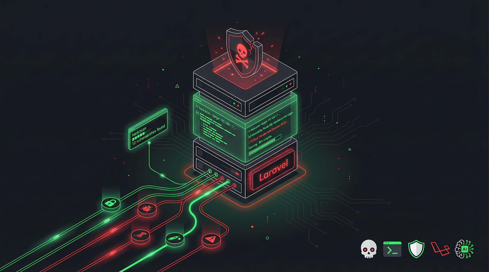
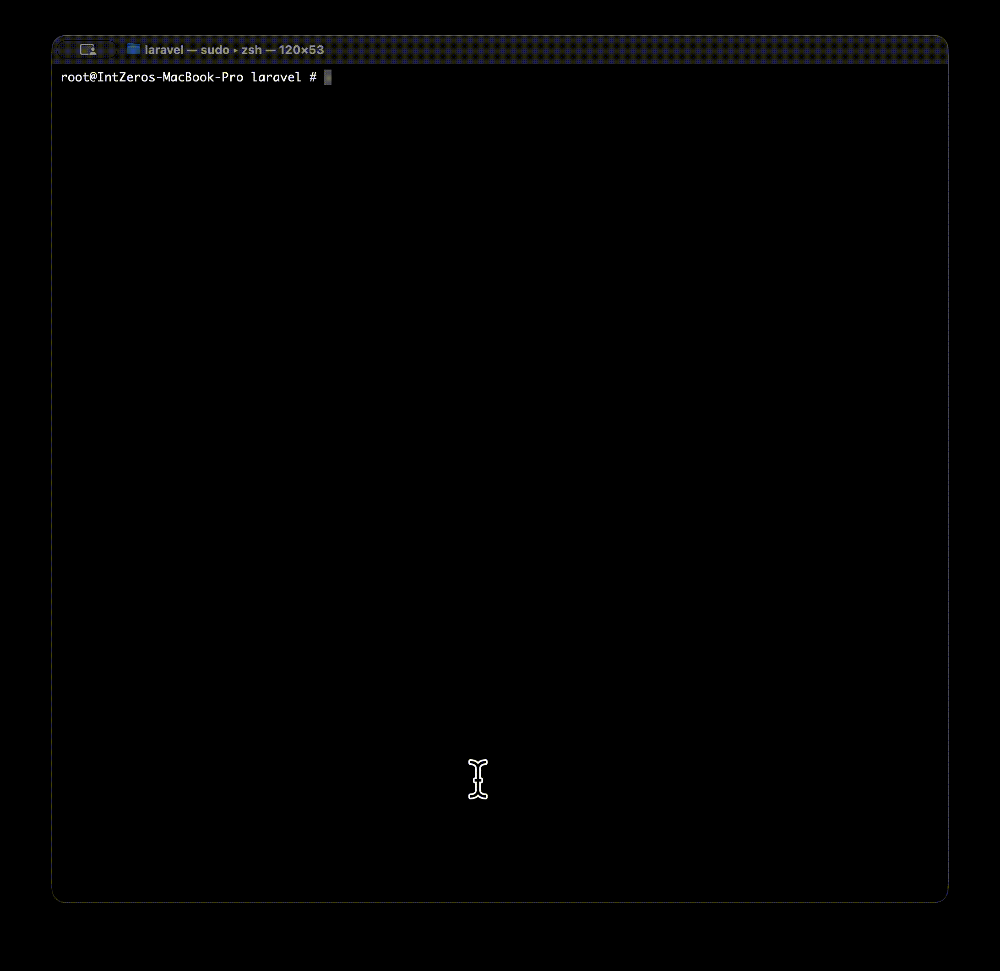

<p align="center">
  
</p>

<h3 align="center">Watch AI hack your Laravel app in 15 seconds.</h3>

<p align="center">
  <a href="https://packagist.org/packages/mahdisphp/laravel-hack-auditor"></a>
  <a href="https://packagist.org/packages/mahdisphp/laravel-hack-auditor"></a>
  <a href="https://github.com/mahdi-salmanzade/laravel-hack-auditor"></a>
</p>

Watch AI literally hack a vulnerable Laravel controller in front of your eyes — no setup, no API key.

<p align="center">
  
</p>

```bash
composer require mahdisphp/laravel-hack-auditor
php artisan hack:demo
```

That's it. Two commands. Watch 12 vulnerabilities get ripped out of a controller in your terminal.

---

## Six commands. That's the whole package.

```bash
php artisan hack:demo                   # See it in action (no API key)
php artisan hack:scan                   # Scan YOUR app with AI
php artisan hack:scan --diff --html     # Scan only changed files, export HTML report
php artisan hack:ctf sql_injection      # Turn vulns into CTF challenges
php artisan hack:report --latest        # Generate HTML report from saved scan
php artisan hack:help                   # Full command reference
php artisan hack:usage                  # Token usage & cost stats
```

**`hack:scan` finds what PHPStan and Snyk can't:**
- "This endpoint fetches a user by ID but never checks ownership" *(IDOR)*
- "Admin check reads `is_admin` from the request, not the session" *(Auth bypass)*
- "Login route has no throttle middleware" *(Brute-forceable)*
- "Any authenticated user can set their own plan to 'pro' without payment" *(Auth bypass)*

12 vulnerability types. OWASP Top 10 mapped. Every finding has file, line, explanation, and a copy-paste fix.

### Low false-positive rate

v1.4 reads your actual Laravel architecture — route middleware stacks, FormRequest `authorize()` methods, Eloquent `$fillable`/`$hidden`, policies, global scopes — and feeds it all to the AI before analysis. Data-flow tracing distinguishes user input from config/hardcoded values. Self-contradicting findings are auto-suppressed. Unrouted controller methods are skipped. Rate limiting is only flagged on auth/payment endpoints, not every route.

Tested on production Laravel apps with 15-42 controllers. Findings you actually need to fix, not noise.

### Token usage & cost tracking

Every scan shows token consumption and estimated cost. Auto-detects your AI provider's pricing from a built-in registry of 30+ models (Anthropic, OpenAI, Gemini, xAI, Ollama). Budget your scans with `--limit`.

```
Token Usage ...... 97,188 prompt + 3,080 completion = 100,268 total
AI Requests ...... 7
Estimated Cost ... $0.5629
Model ............ claude-opus-4-6 (anthropic)
```

## Quick setup (2 minutes)

```bash
php artisan install:ai                  # Install Laravel AI
```

Add one API key to `.env`:

```env
ANTHROPIC_API_KEY=sk-ant-your-key-here  # or OPENAI_API_KEY, or GEMINI_API_KEY
```

Scan:

```bash
php artisan hack:scan
```

Done. The package uses whatever provider you configured in Laravel AI. Optionally override just for this package:

```env
HACK_AUDITOR_AI_PROVIDER=anthropic
HACK_AUDITOR_AI_MODEL=claude-opus-4-6
```

<details>
<summary><strong>All scan flags</strong></summary>

| Flag | What it does |
|------|-------------|
| `--path=app/Http/Controllers` | Scan specific directory or file |
| `--severity=High` | Filter to High+ only |
| `--fix` | Include fix suggestions |
| `--json` | JSON output for CI/CD |
| `--html` | Generate HTML report |
| `--save` | Save results to JSON file |
| `--force` | Skip confirmation prompt |
| `--detailed` | Full descriptions in table |
| `--diff` | Only scan git-changed files (great for CI) |
| `--base=develop` | Base branch for `--diff` |
| `--limit=50000` | Cap token budget for the scan |
| `--update-baseline` | Save current findings as baseline |
| `--no-baseline` | Ignore baseline file |

</details>

## Generate CTF challenges from real vulns

Train your team by turning actual findings into Capture The Flag exercises:

```bash
php artisan hack:ctf sql_injection    # By type
php artisan hack:ctf --from-scan      # From latest scan results
php artisan hack:ctf --all            # Generate for every finding
```

Each challenge outputs a ready-to-run directory: README, vulnerable code, solution, flag file, and docker-compose.

## HTML reports, git-aware scanning, baselines

```bash
php artisan hack:scan --html            # Beautiful dark-themed HTML report
php artisan hack:scan --diff            # Only scan files changed in your branch
php artisan hack:scan --update-baseline # Accept current findings as known
php artisan hack:report --latest        # Regenerate report from saved scan
```

The HTML report is a single self-contained file — dark theme, animated score ring, collapsible cards, copy-paste code blocks, token usage breakdown. Professional enough to attach to a security audit.

`--diff` scans only what your PR touches. `--update-baseline` lets teams acknowledge known risks so CI doesn't fail on accepted findings.

## Use it in code

```php
use Mahdi\HackAuditor\Facades\HackAuditor;
use Mahdi\HackAuditor\Support\UsageTracker;

$report = HackAuditor::scan();

if ($report->hasCritical()) {
    // Block deployment, alert Slack, panic, etc.
}

echo $report->overallScore;                  // 0-100
echo $report->criticalCount();               // int
echo $report->getUsageTracker()?->totalTokens();  // tokens used
echo $report->getUsageTracker()?->estimateCost();  // estimated $$$

// Budget-capped scan
$tracker = new UsageTracker(tokenLimit: 50_000);
$report = HackAuditor::scan(tracker: $tracker);

// Scan history
$history = HackAuditor::history();
$latest = $history->latest();                // array or null
$all = $history->recent(10);                 // last 10 scans
```

<details>
<summary><strong>CI/CD pipeline example</strong></summary>

```yaml
# .github/workflows/security.yml
name: Security Audit
on: [push, pull_request]
jobs:
  hack-audit:
    runs-on: ubuntu-latest
    steps:
      - uses: actions/checkout@v4
      - uses: shivammathur/setup-php@v2
        with:
          php-version: '8.3'
      - run: composer install --no-interaction
      - run: php artisan hack:scan --json --severity=High --force
        env:
          OPENAI_API_KEY: ${{ secrets.OPENAI_API_KEY }}
```

</details>

<details>
<summary><strong>All configuration options</strong></summary>

```bash
php artisan vendor:publish --tag=hack-auditor-config
```

| Option | Default | Description |
|--------|---------|-------------|
| `ai.provider` | `null` | AI provider override |
| `ai.model` | `null` | Model override |
| `ai.temperature` | `0.3` | Lower = more deterministic |
| `ai.timeout` | `120` | HTTP timeout in seconds |
| `scan.paths` | Controllers, Models, Requests, Middleware, routes | What to scan |
| `scan.confirm_above_files` | `20` | Prompt before large scans |
| `scan.sensitive_patterns` | `.env*, *.key, *.pem, storage/logs/*` | Always excluded |
| `context.enabled` | `true` | Context-aware scanning (routes, middleware, policies, models) |
| `context.max_context_tokens` | `8000` | Token budget for context |
| `usage.default_limit` | `0` | Default `--limit` value (0 = unlimited) |
| `usage.show_usage` | `true` | Show token usage after scan |
| `usage.log_enabled` | `true` | Auto-log usage to `storage/hack-auditor/usage.json` |
| `ctf.output_path` | `hack-auditor/ctf` | CTF output directory |

Zero database dependencies. All data stored as JSON files in `storage/hack-auditor/`.

</details>

## Security

This package sends source code to AI providers. Files matching `.env*`, `*.key`, `*.pem`, and `storage/logs/*` are always excluded. Review your provider's data retention policies.

Found a vulnerability in this package? Email **mahdi@mindzone.tech**.

## Contributing

PRs welcome. Run `composer test` and `vendor/bin/pint` before submitting.

## License

MIT — [LICENSE](LICENSE)

---

<p align="center">
  <strong>If this saved you from getting hacked, star the repo.</strong>
</p>
